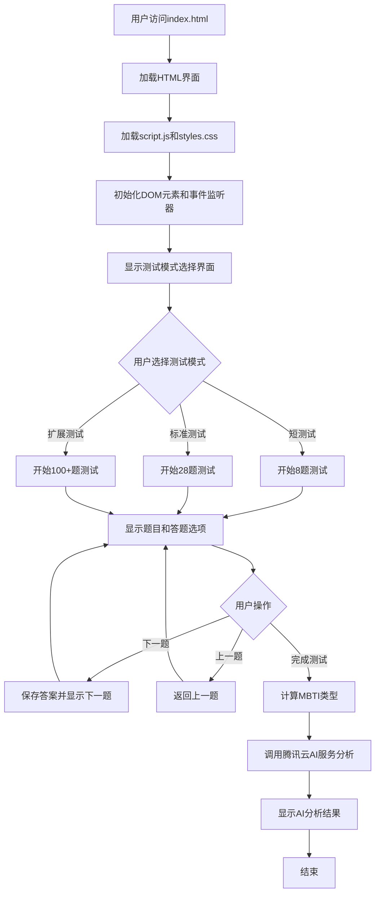
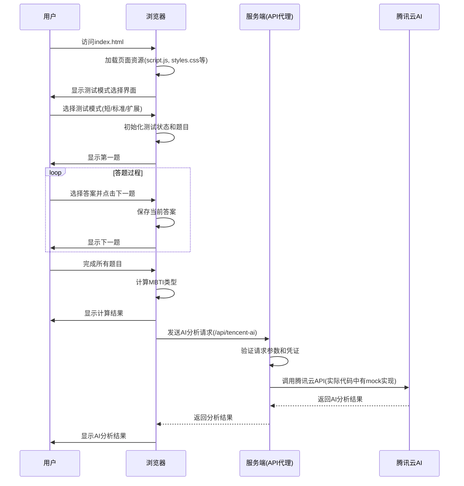
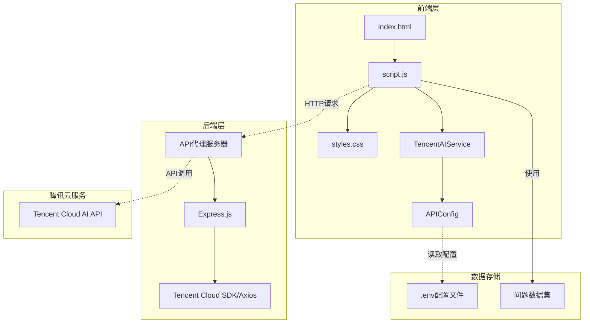

# 项目流程图和时序图

## 项目概述

该项目包含两个主要组件：
1. **AlexNet模型**：一个预训练的深度学习模型
2. **MBTI性格测试**：一个集成了腾讯云AI的Web应用，用于进行人格分析

我们重点关注MBTI性格测试组件的工作流程。

## 流程图

## 时序图

## 组件架构图

## 关键模块说明

### 1. 前端模块 (script.js)
- **测试管理**: 处理不同模式的测试流程
- **用户交互**: 管理题目展示、答案收集和导航
- **结果计算**: 根据用户答案计算MBTI类型
- **AI集成**: 调用TencentAIService进行AI分析

### 2. AI服务模块 (tencent-ai-service.js)
- **配置管理**: 处理API密钥和端点配置
- **API调用**: 实现与后端代理的安全通信
- **错误处理**: 提供降级方案(mock响应)

### 3. 后端代理 (api-proxy.js)
- **安全代理**: 在服务器端处理敏感凭证
- **请求转发**: 将前端请求转发至腾讯云API
- **响应处理**: 处理并返回API响应

### 4. 配置管理 (api-config.js)
- **环境配置**: 管理不同环境下的API设置
- **默认值**: 提供合理的默认配置

这个项目采用了前后端分离的架构设计，通过后端代理来保护API密钥的安全性，并提供了完整的MBTI测试流程和AI分析功能。